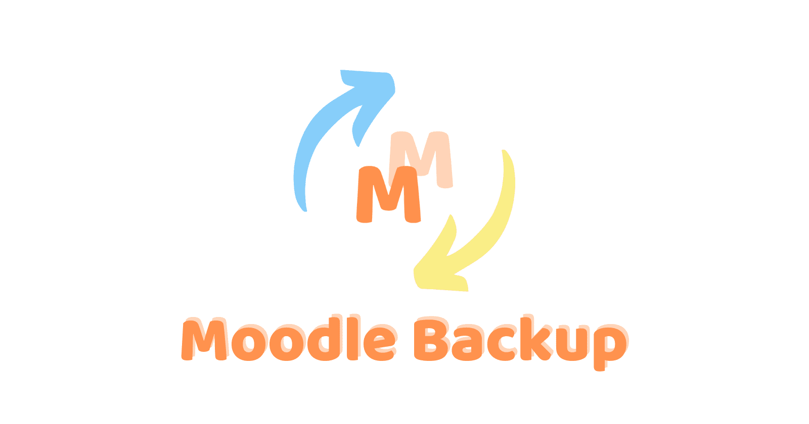

# Moodle Backup

Backup Your Personal Data from Moodle.



## Usage

There are three ways to use this tool:

1. It can be used as a command line tool, simply run `moodle-backup` in your terminal.
2. It can be used as a Node.js module, simply install `moodle-backup-core` and use it in your code.
3. It can be used as a web app, simply run `moodle-backup-server` in your terminal, or go to [https://moodle-backup.jacoblin.cool](https://moodle-backup.jacoblin.cool) if you are a NTNU student.

> `pnpm` in the following instructions is a package manager, you can use `npm` or `yarn` instead.

### Command Line

You can install `moodle-backup` globally by running `pnpm i -g moodle-backup`.

Then you can run `moodle-backup [options] [username] [password]` in your terminal.

> If you do not have chrome or chromium installed, you may need to manually install it before using this tool.

### Node.js Module

You can install `moodle-backup-core` by running `pnpm i moodle-backup-core`.

Then you can use it in your code:

```ts
import { Exporter } from "moodle-backup-core";

const exporter = new Exporter(MOODLE_URL, USERNAME, PASSWORD, OUTPUT_DIR);
await exporter.run();
```

### Web App

You can install `moodle-backup-server` by running `pnpm i -g moodle-backup-server`.

Then you can run `moodle-backup-server` in your terminal, and go to `http://localhost:3000` in your browser.

There is also a prebuilt Docker image available at [https://hub.docker.com/r/jacoblincool/moodle-backup-server](https://hub.docker.com/r/jacoblincool/moodle-backup-server), which supports `arm64` and `amd64` architectures.

> You can find the supported environment variables in the [packages/server/src/config.ts](packages/server/src/config.ts)
